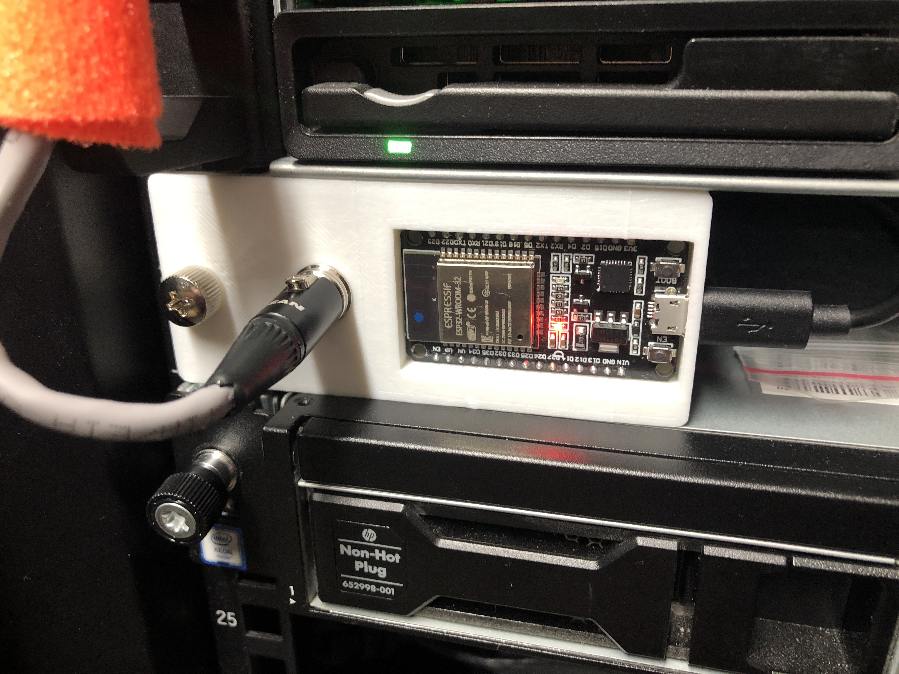
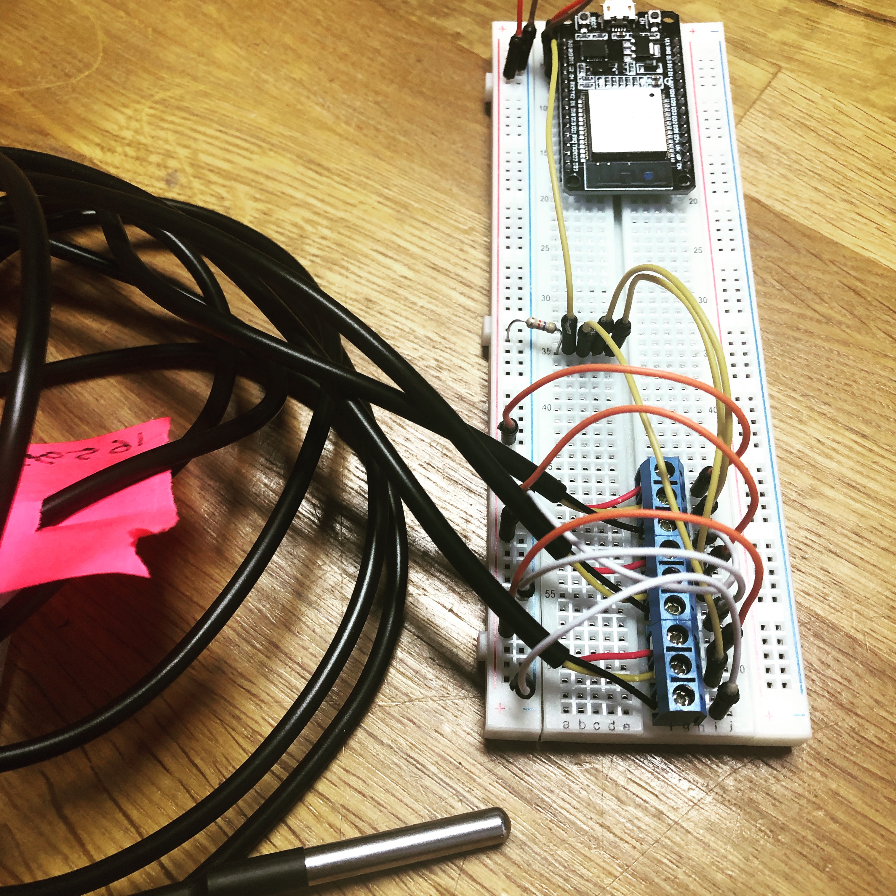
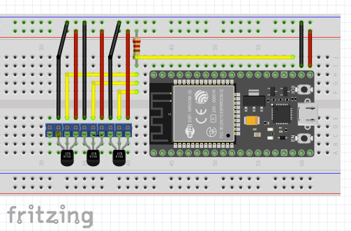
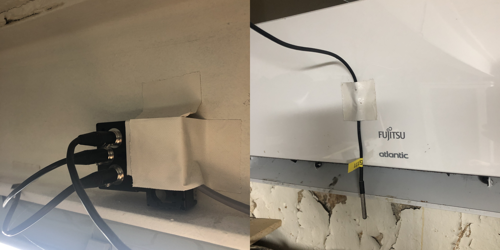
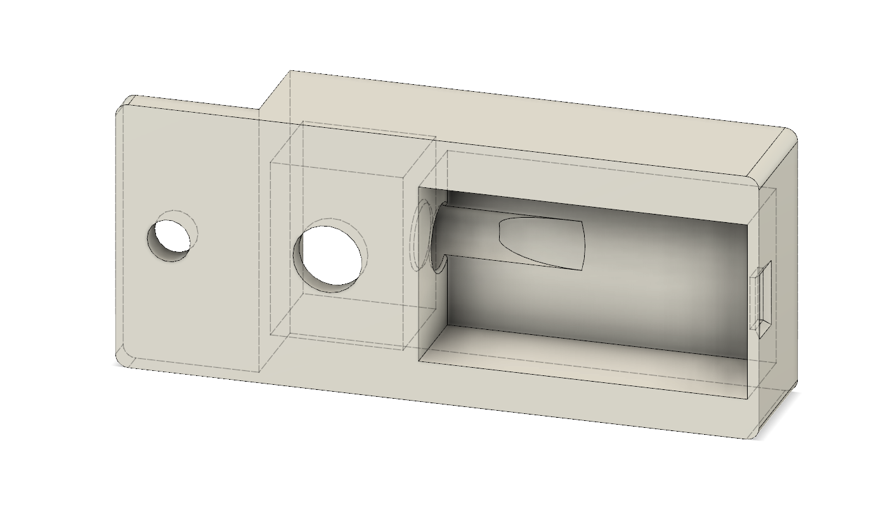
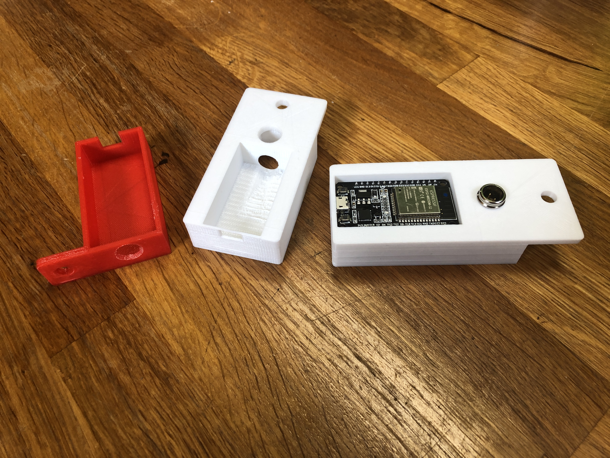
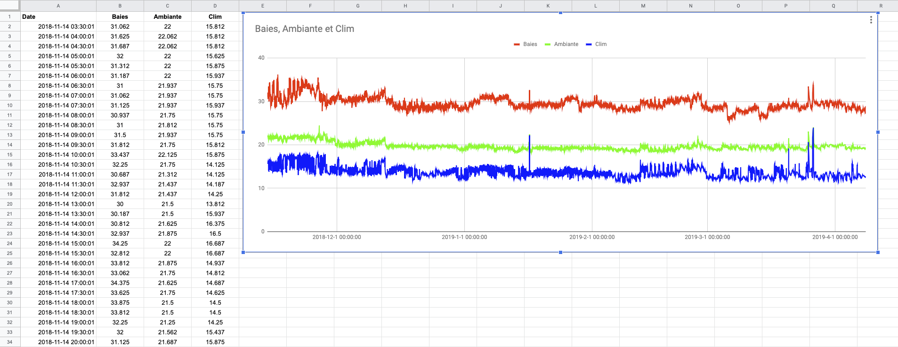
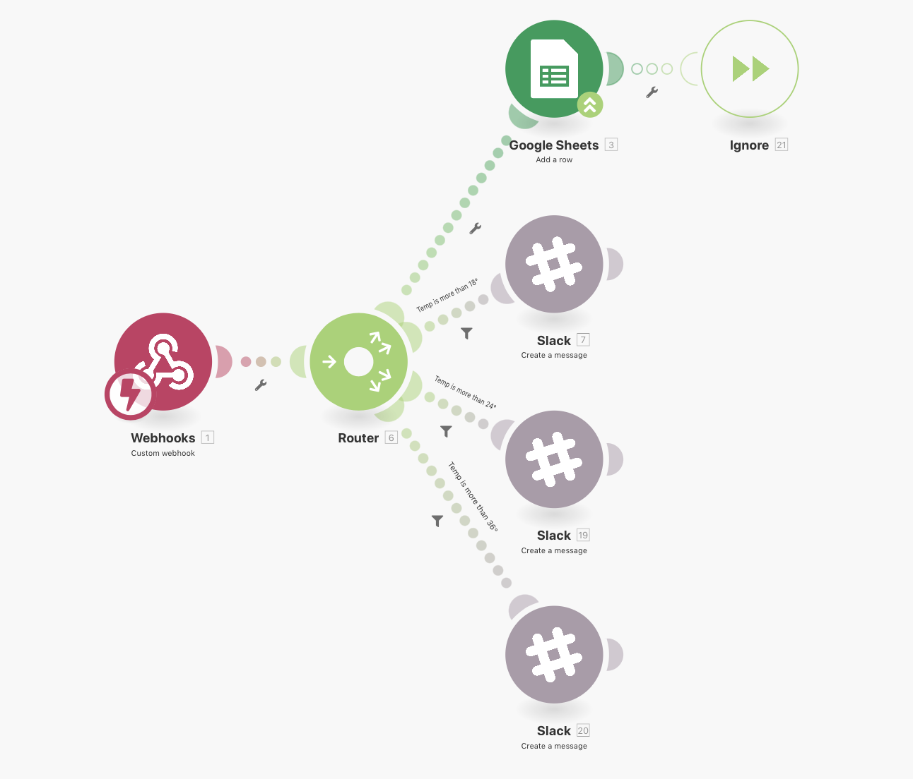
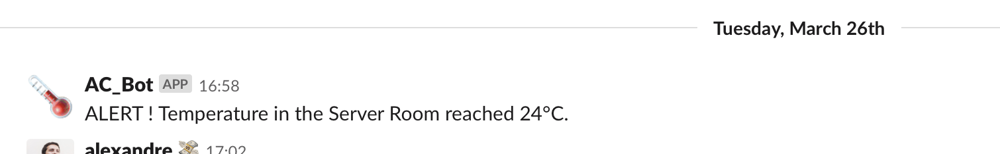

*UPDATE : I added code for Olimex ESP32 (https://github.com/OLIMEX/ESP32-POE) with ethernet port as wifi was way too unreliable. I will update the case design as well.*

# A Data Center Temperature Monitor
A temperature monitor based on and ESP32 and DS18B20 sensors, that can be mounted in a server rack.

## The project

I know, yet another temperature monitor ...
This is my first complete project that involves CAD design, 3D printing, electronics prototyping, C code (I am not a developer ;) and webhooks.

Goals of this project : 
- Getting temperatures from the 3 sensors (AC, back of the cabinets and ambient) 
- Log the temperatures and build a graph to monitor trends overtime.
- Send live alerts when a temperature level is reached.

## Connecting the sensors to the controller

I initially prototyped the temperature monitor using the typical breadboard :

I spliced the sensors to Cat5 network cables and ended with mini-XLR connectors (they have 3 pins and a locking lever). 
The DS18B20 is accessed through a one wire bus, it means that they are all connected to the same wire and you can add sensors as long as you power them accordingly.

*I used a old epson ribbon printer cartridge to group 3 female plugs at the end of the main wire. Now I could easily go with another group of sensors going out of one of these plugs ...*

Each sensor has an address and you can use the code from the `DS18B20 Sensor Address.c` sketch to figure them out. Upload the sketch to the esp32, plug one of the sensor, switch on, read the value in the serial monitor, switch off, plug another sensor, ...

Label your sensors in case you want to move them or reuse them.

## The Case

The first interation of the case revealed that wifi does not do well when the antenna of the controller is placed between 2 server blades (and the access to the usb plug was really bad) :

I messed up some dimentions and had to go back to f360 to fix the problems :

*(3D printing is awesome)*

Final case :

## The Code

The code is pretty straightforward, I used a lot of existing bits and stiched everything together. It probably lacks some error checkings while posting. 
The SSL part of the webhook gave me some headhaches (Thanks you Alex for your help !).
Make sure you include all the required librairies !

## Posting the temperature values

We are using Inegromat for several other projects and it is really cool to use.
Values are read by the controller and then posted to Integromat via a WebHook. Integromat then stores the values in a Google sheet (we may move this to a logstash/kibana).

If one of tha values goes beyond a set theshold, an alert is send to a Slack Channel.

## Final considerations
~Wifi ... Well ... is ... Wifi ...
I will probably be looking into an ethernet shield for the ESP32 soon.~

Move to an Olimex ESP32-POE is done ! I uploaded the new code and will uplaod the case files as soon as it is prfect.
https://github.com/OLIMEX/ESP32-POE

