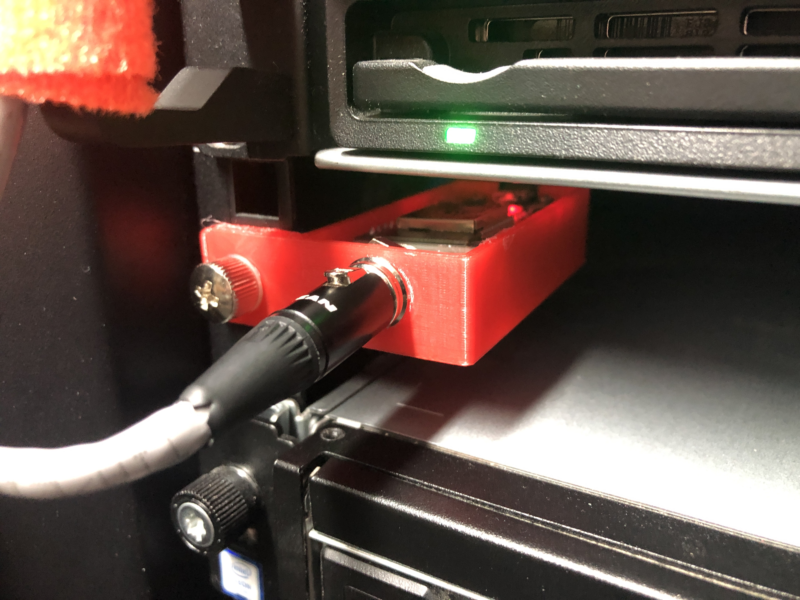

WIP (2019-04-08)

# Data-center-temperature-monitor
A temperature monitor based on and ESP32 and DS18B20 sensors, that can be mounted in a server rack.

## The project

I know, yet another temperature monitor ...
This is my first complete project that involves CAD design, 3D printing, electronics prototyping, C code (I am not a developer ;) and webhooks.

Goals of this project : 
- Getting temperatures from the 3 sensors (AC, back of the cabinets and ambient) 
- Log the temperatures and graph these to monitor trends overtime.
- Send alerts when a level is reached.

## Connecting the sensors to the controller

I initially prototyped the temperature monitor using the typical breadboard :

To end the Cat5 network cable, I used some mini-XLR connectors (they hav 3 pins and a locking lever). 
The DS18B20 use a one wire bus, it means that they are all connected to the same wire and you can add some sensors as long as you power them accordingly.

I used a old epson ribbon printer cartridge to group 3 female plugs at the end of the main wire. I could go with another group of sensors coming from one of these plugs.

Each sensor has an address and you can use the code from the `DS18B20 Sensor Address.c` sketch to figure them out. Upload the sketch to the esp32, plug one of the sensor, switch on, read the value in the serial monitor, switch off, plug another sensor, ...

Label your sensors in case you want to move them or reuse them.

## The Case

The first interation of the case revealed that wifi does not do well when the antenna of the controller is placed between 2 server blades (and the access to the usb plug was really bad) :

I messed up some dimentions and had to go back to f360 to fix the problems :

(3D printing is awesome)

Final case :

## The Code

The code is pretty straightforward, i used a lot of existing bits and stiched everything together. It probably lacks some checkings when erros occurs while posting. 
The SSL part of the webhook gave me some headhaches and fortunateluy i had help from a developer colleague.
Make sure you include all the required librairies.

## Posting the temperature values

We are using Inegromat for several other projects and it is really cool to use.
Values are read by the controller and then posted to Integromat via a WebHook. Integromat stores the values in a Google sheet (we plan on moving this to a logstash/kibana soon).

If one of tha values goes beyond a set theshold, an alert is send to a Slack Channel.

